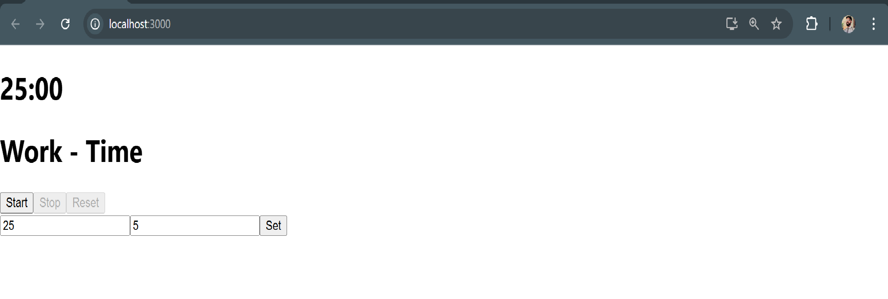

# Pomodoro Timer Application

## Project Description
The **Pomodoro Timer Application** is a React-based productivity tool that helps users manage their work and break times effectively. The app follows the Pomodoro Technique, which alternates between focused work sessions and short breaks. Users can customize the durations, start and pause the timer, and reset the settings to default values.

---

## Features

- **Two Modes**: Work and Break modes.
- **Customizable Durations**: Users can set work and break durations in minutes.
- **Dynamic Timer**: Automatically switches between Work and Break modes when the timer ends.
- **Formatted Time Display**: Time is displayed in the `MM:SS` format.
- **Timer Controls**:
  - **Start**: Starts the timer.
  - **Stop**: Pauses the timer.
  - **Reset**: Resets all values to default (25 minutes for work, 5 minutes for break).
- **Notifications**: Alerts the user when work or break time is complete.
- **Input Validation**: Ensures the duration inputs are numeric.

---

## Default Settings

- **Work Duration**: 25 minutes.
- **Break Duration**: 5 minutes.

---

## Tech Stack

- **React**: Used for building the application.
- **Hooks**: `useState` and `useEffect` for state and side-effect management.

---

## Installation and Setup

1. **Clone the Repository**:
   ```bash
   git clone <repository-link>
   cd pomodoro-timer
   ```

2. **Install Dependencies**:
   ```bash
   npm install
   ```

3. **Run the Application**:
   ```bash
   npm start
   ```

4. Open your browser and navigate to `http://localhost:3000`.

---

## Usage

1. Launch the application.
2. Enter custom durations for work and break times (optional).
3. Click **Set** to save the custom durations.
4. Click **Start** to begin the timer.
5. Use **Stop** to pause the timer and **Reset** to restore default values.
6. Notifications will alert you when work or break time ends.

---

## Screenshot
Here is a screenshot of the Pomodoro Timer: <br>


---

## Code Overview

### Key Components

1. **State Variables**:
   - `workDuration`, `breakDuration`: Customizable durations in minutes.
   - `workSecond`, `breakSecond`: Converted durations in seconds for countdown.
   - `type`: Tracks current mode ("Work" or "Break").
   - `flag`: Indicates whether the timer is running.
   - `resetFlag`: Enables/disables the Reset button.

2. **Core Logic**:
   - `useEffect`: Manages the countdown logic and automatic mode switching.
   - `formatSpecifier`: Converts seconds to `MM:SS` format.

3. **Functions**:
   - `handleReset`: Resets all values to default.
   - `handleSubmit`: Updates durations based on user input.

4. **UI Elements**:
   - Timer display.
   - Start, Stop, and Reset buttons.
   - Input fields for setting custom durations.

---

## Repository Structure

```plaintext
pomodoro-timer/
├── public/
│   ├── index.html
│   └── screenshot.png
├── src/
│   ├── App.js
│   ├── index.js
│   └── Pomodoro.js
├── .gitignore
├── package.json
├── package-lock.json
└── README.md
```

---

## Contributions

Contributions are welcome! Feel free to fork this repository and submit pull requests.

---

## License

This project is licensed under the MIT License.

---

## Contact

For any queries or feedback, please contact [pramodkumar912894@gmail.com].

---


